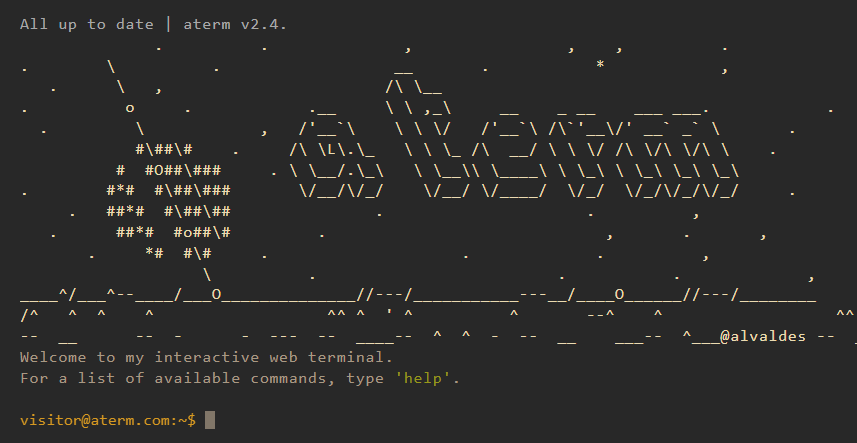
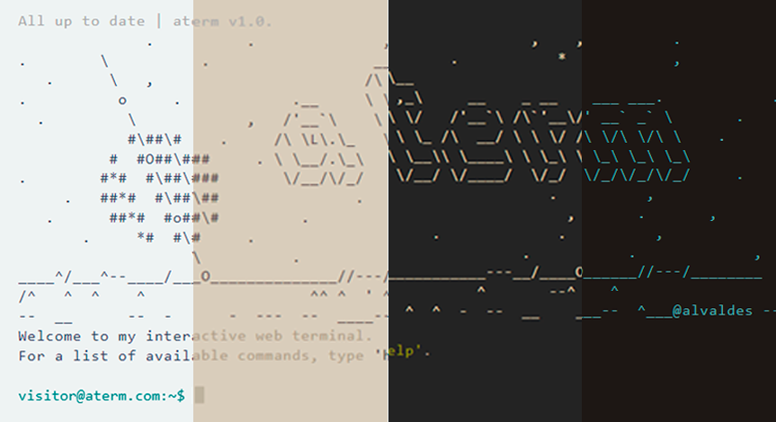

# Terminal Porfolio Website by alvaldes



[](https://aterm.netlify.app)


My portfolio website in terminal version developed just with HTML, CSS and JavaScript. Multiple themes supported and keyboard shortcuts can be used for some functionalities.

## Features

- Responsive Design 📱💻
- Multiple themes 🎨
- Autocomplete feature ✨ (TAB)
- Go previous and next command (ctrl+p/⬆️|⬇️)
- View command history 📖
- Display weather from some city ☁️🌡️
- Well-tested ✅ LightHouse

## Tech Stack

**Develpment** - HTML, CSS & JavaScript
**Testing** - LightHouse
**Deployment** - [Netlify](https://app.netlify.com/)

## Multiple Theme

Currently, this website supports 4 themes. Type `theme` in the terminal for more info.


## LightHouse Score

<p align="center">

</p>

## Running Locally

Clone this project

```bash
git clone https://github.com/alvaldes/aterm.git
```

Go to the project directory

```bash
cd aterm
```

Open the index file

```bash
./index.html
```

## Inspiration and Credits

Here are some inspiration for this kind of terminal website.

- [term m4tt72](https://term.m4tt72.com/)
- [Fkcode](https://fkcodes.com/)
- [satnaing](https://terminal.satnaing.dev/)
